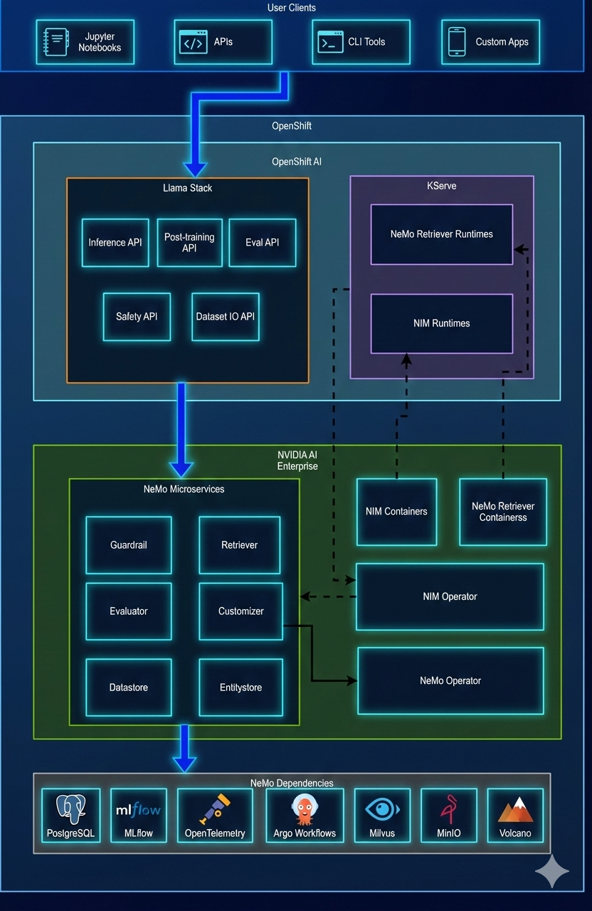

# NeMo Infrastructure Components Helm Chart

A Helm chart for deploying NVIDIA NeMo infrastructure components on OpenShift, including PostgreSQL databases, MLflow, Argo Workflows, Milvus, OpenTelemetry, MinIO, Jupyter Notebook, and Volcano Scheduler.

## Table of Contents

1. [Overview](#overview)
2. [Prerequisites](#prerequisites)
3. [Components](#components)
4. [Quick Start](#quick-start)
5. [Configuration](#configuration)
6. [Uninstallation](#uninstallation)
7. [Troubleshooting](#troubleshooting)
8. [OpenShift Specific Configuration](#openshift-specific-configuration)
9. [Multi-Tenant Safety](#multi-tenant-safety)
10. [Chart Structure](#chart-structure)
11. [Dependencies](#dependencies)
12. [Notes about images used in the deployment](#notes-about-images-used-in-the-deployment)
13. [Version Information](#version-information)
14. [Contributing](#contributing)
15. [License](#license)
16. [Support](#support)

## Overview

This Helm chart deploys all infrastructure components required for NVIDIA NeMo microservices on OpenShift. It manages dependencies through Helm subcharts and provides OpenShift-specific configurations including Security Context Constraints (SCCs) and RBAC.

> ⚠️ **IMPORTANT: DEVELOPMENT ENVIRONMENT ONLY**
> 
> This Helm chart is configured for **development/testing environments only**. It uses hardcoded default passwords for ease of deployment. **DO NOT use these defaults in production**. For production deployments, all passwords must be moved to externally-managed Kubernetes Secrets. See [SECRETS-AUDIT.md](../SECRETS-AUDIT.md) for details.

### Key Features

- **Unified Deployment**: Single Helm command deploys all infrastructure components
- **Conditional Installation**: Enable/disable components via `values.yaml`
- **OpenShift Optimized**: Includes SCC configurations, RBAC, and OpenShift-specific settings
- **Namespace Scoped**: Components can be scoped to specific namespaces for multi-tenant safety
- **Persistent Storage**: Configurable PVCs for all stateful components
- **Development-Friendly**: Default passwords simplify local development (dev-only)

## Prerequisites

> **Note**: General prerequisites (OpenShift 4.x, Helm 3.x, `oc` CLI, NGC API key, GPU nodes) are documented in the [main README](../../README.md). This section covers only infrastructure-specific prerequisites for deploying services.

- Sufficient cluster resources (CPU, memory, storage)
- Access to container registries (Docker Hub, NGC, etc.)
- **NGC Helm repository** must be added and authenticated (required for NeMo Operator dependencies):
  ```bash
  # Add NGC Helm repository (requires authentication)
  helm repo add nvidia-nemo https://helm.ngc.nvidia.com/nvidia-nemo
  helm repo update
  ```

## Components

| Component | Purpose |
|-----------|---------|
| **Datastore PostgreSQL** | Database for NeMo Datastore microservice |
| **Entity Store PostgreSQL** | Database for NeMo Entity Store microservice |
| **Customizer Components** | PostgreSQL, MLflow, and OpenTelemetry Collector for NeMo Customizer microservice |
| **Guardrail PostgreSQL** | Database for NeMo Guardrail microservice |
| **Evaluator Components** | PostgreSQL, Argo Workflows, Milvus, and OpenTelemetry Collector for NeMo Evaluator microservice |
| **Jupyter Notebook** | Jupyter Notebook server for NeMo development and testing |
| **MinIO** | Object storage for MLflow artifacts and other data |
| **Volcano Scheduler** | Advanced scheduler for Kubernetes workloads, required for NeMo Operator |

### Archtecture Diagram


## Quick Start

### Installation

```bash
# Navigate to chart directory
cd deploy/nemo-infra

# Update dependencies
helm dependency update

# Deploy all services
helm install nemo-infra . \
  -n <namespace> \
  --create-namespace
```

### Upgrade

```bash
# Upgrade existing deployment
helm upgrade nemo-infra . \
  -n <namespace>
```

### Verify Installation

```bash
# Check all pods are running
oc get pods -n <namespace>

# Check specific component
oc get pods -n <namespace> | grep postgresql
oc get pods -n <namespace> | grep volcano
```

<details>
<summary><strong>Example: Verify All Infrastructure Components</strong></summary>

To verify all infrastructure components are running, use the following command:

```bash
# Replace <namespace> with your actual namespace, e.g., arhkp-nemo-helm
oc get pods -n <namespace> | grep -E "(postgresql|mlflow|volcano|argo|milvus|opentelemetry|jupyter|minio)"
```

**Expected Output:**
```
jupyter-notebook-5fc745674d-9gq29                                1/1     Running     0          175m
nemo-infra-argo-workflows-server-6ccf84f45d-rnvxg                1/1     Running     0          175m
nemo-infra-argo-workflows-workflow-controller-68d456d755-hds5p   1/1     Running     0          175m
nemo-infra-customizer-mlflow-tracking-6787ff598-fjmmr            1/1     Running     0          175m
nemo-infra-customizer-opentelemetry-648455b458-zq8v6             1/1     Running     0          175m
nemo-infra-customizer-postgresql-0                               1/1     Running     0          175m
nemo-infra-datastore-postgresql-0                                1/1     Running     0          175m
nemo-infra-entity-store-postgresql-0                             1/1     Running     0          175m
nemo-infra-evaluator-milvus-standalone-86599fc78f-gkhhv          1/1     Running     0          175m
nemo-infra-evaluator-opentelemetry-577d4d757-lnlcm               1/1     Running     0          175m
nemo-infra-evaluator-postgresql-0                                1/1     Running     0          175m
nemo-infra-guardrail-postgresql-0                                1/1     Running     0          175m
nemo-infra-minio-89bdcdd79-s28km                                 1/1     Running     0          175m
nemo-infra-postgresql-0                                          1/1     Running     0          175m
```

All pods should show `1/1 Running` status. If any pods are not running, check the troubleshooting section.

</details>

## Configuration

### Main Configuration File

The main configuration is in `values.yaml`. Key sections:

- `namespace`: Namespace configuration
- `pvc`: Persistent volume claim settings
- `localPathProvisioner`: Local path provisioner for storage
- `install`: Component enable/disable flags

### Component Installation Flags

```yaml
install:
  datastore: true      # Datastore PostgreSQL
  entityStore: true    # Entity Store PostgreSQL
  customizer: true     # Customizer (PostgreSQL, MLflow, OpenTelemetry)
  guardrail: true      # Guardrail PostgreSQL
  evaluator: true      # Evaluator (PostgreSQL, Argo, Milvus, OpenTelemetry)
  jupyter: true        # Jupyter Notebook
  volcano: true        # Volcano Scheduler
```

### Customizing Values

```bash
# Deploy services with custom values
helm install nemo-infra ./deploy/nemo-infra \
  -n <namespace> \
  --set namespace.name=my-namespace \
  --set pvc.storageClass=gp3-csi
```

## Uninstallation

### Standard Uninstall

```bash
# Uninstall Helm release
helm uninstall nemo-infra -n <namespace>

# Clean up PVCs (optional)
oc delete pvc --all -n <namespace>

# Clean up webhooks (optional)
oc delete validatingwebhookconfigurations \
  volcano-admission-service-jobs-validate \
  volcano-admission-service-pods-validate \
  volcano-admission-service-queues-validate
```

### Full Cleanup

```bash
# Uninstall
helm uninstall nemo-infra -n <namespace>

# Delete PVCs
oc delete pvc --all -n <namespace>

# Delete remaining resources
oc delete all --all -n <namespace>
oc delete configmap,secret,serviceaccount,role,rolebinding --all -n <namespace>

# Delete cluster resources (if needed)
oc delete clusterrole,clusterrolebinding -l component=volcano
oc delete validatingwebhookconfigurations | grep volcano
```

## Troubleshooting

<details>
<summary><strong>Pods Not Starting</strong></summary>

**Check pod status:**
```bash
oc get pods -n <namespace>
oc describe pod <pod-name> -n <namespace>
oc logs <pod-name> -n <namespace>
```

</details>

<details>
<summary><strong>Image Pull Errors</strong></summary>

**Verify image pull secrets:**
```bash
oc get secrets -n <namespace> | grep pull
oc describe pod <pod-name> -n <namespace> | grep -A 5 "ImagePull"
```

**Common fixes:**
- Ensure image pull secrets are configured
- Check registry access
- Verify image tags exist

</details>

<details>
<summary><strong>Storage Issues</strong></summary>

**Check PVC status:**
```bash
oc get pvc -n <namespace>
oc describe pvc <pvc-name> -n <namespace>
```

**Common fixes:**
- Verify storage class exists
- Check storage quota
- Ensure sufficient storage capacity

</details>

<details>
<summary><strong>Volcano Issues</strong></summary>

**Check Volcano components:**
```bash
oc get pods -n <namespace> | grep volcano
oc get deployments -n <namespace> | grep volcano
oc get validatingwebhookconfigurations | grep volcano
```

**Common issues:**

1. **Scheduler pod failing:**
   - Verify `privileged` SCC is granted
   - Check service account: `nemo-infra-scheduler`
   - Command: `oc adm policy add-scc-to-user privileged system:serviceaccount:<namespace>:nemo-infra-scheduler`

2. **Admission pod failing:**
   - Check ClusterRole permissions
   - Verify service exists: `nemo-infra-admission-service`
   - Check webhook configuration

3. **Webhook errors:**
   - Verify webhooks are scoped to correct namespace
   - Check service endpoints
   - Verify certificates

</details>

<details>
<summary><strong>Argo Workflows Issues</strong></summary>

**Check Argo components:**
```bash
oc get pods -n <namespace> | grep argo
oc get crd | grep workflow
```

**Common issues:**
- CRDs not installed: Ensure `evaluator-argo.crds.install: true`
- Controller not starting: Check service account permissions

</details>

<details>
<summary><strong>PostgreSQL Connection Issues</strong></summary>

**Check PostgreSQL pods:**
```bash
oc get pods -n <namespace> | grep postgresql
oc logs <postgresql-pod> -n <namespace>
```

**Common fixes:**
- Verify service names match in connection strings
- Check authentication credentials
- Ensure pods are ready before connecting

</details>

## OpenShift Specific Configuration

<details>
<summary><strong>Security Context Constraints (SCCs)</strong></summary>

**Configured SCCs:**

1. **anyuid** - Used by:
   - Jupyter Notebook
   - Milvus

2. **privileged** - Used by:
   - Volcano Scheduler (required for hostPath volumes)

**SCC Configuration:**
- Managed via RBAC Role/Binding in templates
- Jobs can also grant SCCs via `oc adm policy` commands

</details>

<details>
<summary><strong>RBAC Configuration</strong></summary>

**Service Accounts:**
- Each component has its own service account
- Names follow pattern: `<release-name>-<component>`

**Roles and RoleBindings:**
- Namespace-scoped for SCC access
- Cluster-scoped for Volcano webhooks and CRDs

</details>

<details>
<summary><strong>Storage Configuration</strong></summary>

**Storage Classes:**
- Default: `gp3-csi` (AWS EBS)
- Configurable via `values.yaml`:
  ```yaml
  pvc:
    storageClass: gp3-csi
  ```

**Local Path Provisioner:**
- Optional local storage provisioner
- Enable via `localPathProvisioner.enabled: true`

</details>

## Multi-Tenant Safety

<details>
<summary><strong>Volcano Webhook Scoping</strong></summary>

Volcano webhooks are scoped to specific namespaces to prevent interference with other workloads.

**Configuration:**
```yaml
volcano:
  custom:
    webhooks_namespace_selector_expressions:
      - key: kubernetes.io/metadata.name
        operator: In
        values:
          - arhkp-nemo-helm  # Deployment namespace
          # Add additional namespaces if needed
```

**Default Behavior:**
- Webhooks only affect resources in specified namespaces
- Other namespaces are unaffected by Volcano webhooks

**Adding Additional Namespaces:**
```yaml
volcano:
  custom:
    webhooks_namespace_selector_expressions:
      - key: kubernetes.io/metadata.name
        operator: In
        values:
          - arhkp-nemo-helm
          - another-namespace
          - shared-namespace
```

</details>

<details>
<summary><strong>Resource Isolation</strong></summary>

- Each component uses namespace-scoped resources
- PVCs are namespace-scoped
- Services are namespace-scoped
- Only webhooks and CRDs are cluster-scoped (with namespace selectors)

</details>

## Chart Structure

```
nemo-infra/
├── Chart.yaml              # Chart metadata and dependencies
├── values.yaml             # Default configuration values
├── Chart.lock              # Locked dependency versions
├── templates/
│   ├── _helpers.tpl        # Template helpers
│   ├── namespace.yaml      # Namespace resource
│   ├── jupyter/            # Jupyter Notebook templates
│   ├── evaluator/          # Evaluator component templates
│   └── volcano/            # Volcano-specific templates
│       ├── oc-rbac.yaml    # OpenShift RBAC configuration
│       ├── webhook-patch.yaml  # Webhook namespace scoping
│       └── clusterrole-patch.yaml  # ClusterRole patches
└── README.md              # This file
```

## Dependencies

This chart depends on the following Helm charts:

- **PostgreSQL** (Bitnami): 16.0.0
- **MLflow** (Bitnami): 1.0.6
- **OpenTelemetry Collector**: 0.93.3
- **Argo Workflows**: 0.40.11
- **Milvus**: 4.1.11
- **Volcano**: 1.9.0

## Notes about images used in the deployment

This deployment on OpenShift is inspired by Nvidia's [k8s-nim-operator](https://github.com/NVIDIA/k8s-nim-operator) (tag v3.0.0) and we had to do minor changes to images as follows.

| Component | v3.0.0 Original Image | NeMo-Microservices/deploy Image | Reason for Change |
|-----------|----------------------|----------------------------------|-------------------|
| **PostgreSQL (All instances)** | `bitnamilegacy/postgresql` (no explicit registry/tag, relies on chart defaults) | `registry-1.docker.io/bitnami/postgresql:latest` | Changed to `bitnami` (from `bitnamilegacy`) with explicit registry and tag for reliability and OpenShift compatibility |
| **MLflow Python** | `library/python:3.9-slim` (in mlflow.yaml) | `docker.io/library/python:3.9-slim` | Added explicit `docker.io` registry prefix for clarity |
| **MLflow Git** | `alpine/git:latest` (in mlflow.yaml) | `docker.io/alpine/git:latest` | Added explicit `docker.io` registry prefix for clarity |
| **MLflow Busybox** | `library/busybox:latest` (in mlflow.yaml) | `docker.io/library/busybox:latest` | Added explicit `docker.io` registry prefix for clarity |
| **MinIO** | `minio/minio:latest` (in mlflow.yaml) | `quay.io/minio/minio:latest` | Changed to explicit `quay.io` registry for OpenShift compatibility |
| **MLflow PostgreSQL** | `bitnami/postgresql:latest` (in mlflow.yaml) | `registry-1.docker.io/bitnami/postgresql:latest` | Added explicit `registry-1.docker.io` registry prefix |
| **OpenTelemetry Collector** | `otel/opentelemetry-collector-k8s:0.102.1` | `otel/opentelemetry-collector-k8s:0.102.1` | No change - same version |
| **Jupyter Notebook** | `jupyter/base-notebook:latest` | `jupyter/base-notebook:latest` | No change - same image |
| **Jupyter Init Container** | `busybox` (no tag) | `busybox` (no tag) | No change - same image |
| **OpenShift CLI** | ❌ Not present in v3.0.0 | `registry.redhat.io/openshift4/ose-cli:latest` | **NEW** - Added for Volcano webhook patching jobs |

### Summary of Changes

- **Infrastructure Images**: Most infrastructure images remain functionally the same, with explicit registry prefixes added for OpenShift compatibility and reliability
- **PostgreSQL**: Changed from `bitnamilegacy/postgresql` (implicit, chart default) to `registry-1.docker.io/bitnami/postgresql:latest` (explicit registry and tag)
- **MinIO**: Changed from `minio/minio:latest` to `quay.io/minio/minio:latest` (explicit registry for OpenShift)
- **OpenShift Integration**: Added OpenShift-specific utility images (`registry.redhat.io/openshift4/ose-cli`) for webhook management

**Note**: 
- Argo Workflows, Milvus, and Volcano images are managed by their respective Helm charts and inherit default images from those charts. These were not explicitly defined in v3.0.0 either.
- NeMo microservices, operators, and evaluation tool images are documented in the `nemo-instances` chart README.

## Version Information

- **Chart Version**: 1.0.0
- **App Version**: 25.06
- **Helm Version**: 3.x required

## Contributing

When contributing to this chart:

1. Update version in `Chart.yaml`
2. Update `values.yaml` with new configuration options
3. Add templates in appropriate directories
4. Update this README with new features
5. Test on OpenShift cluster before submitting

## License

See LICENSE file in the repository root.

## Support

For issues and questions:
- Check troubleshooting section
- Review OpenShift documentation
- Contact NVIDIA NeMo team

---

**Last Updated**: November 2025
**OpenShift Version**: 4.x
**Helm Version**: 3.x
