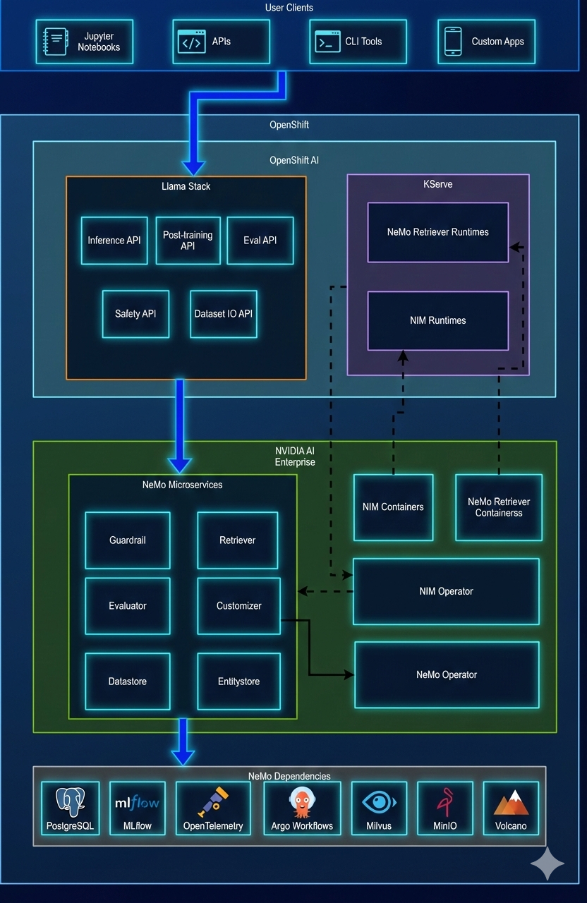

# NeMo Infrastructure Components Helm Chart

A Helm chart for deploying NVIDIA NeMo infrastructure components on OpenShift, including PostgreSQL databases, MLflow, Argo Workflows, Milvus, OpenTelemetry, MinIO, and Volcano Scheduler.

## Table of Contents

1. [Overview](#overview)
2. [Prerequisites](#prerequisites)
3. [Components](#components)
4. [Quick Start](#quick-start)
5. [Configuration](#configuration)
6. [Uninstallation](#uninstallation)
7. [Troubleshooting](#troubleshooting)
8. [OpenShift Specific Configuration](#openshift-specific-configuration)
9. [Multi-Tenant Safety](#multi-tenant-safety)
10. [Chart Structure](#chart-structure)
11. [Dependencies](#dependencies)
12. [Notes about images used in the deployment](#notes-about-images-used-in-the-deployment)
13. [Version Information](#version-information)
14. [Contributing](#contributing)
15. [License](#license)
16. [Support](#support)

## Overview

This Helm chart deploys all infrastructure components required for NVIDIA NeMo microservices on OpenShift. It manages dependencies through Helm subcharts and provides OpenShift-specific configurations including Security Context Constraints (SCCs) and RBAC.

> ⚠️ **IMPORTANT: DEVELOPMENT ENVIRONMENT ONLY**
> 
> This Helm chart is configured for **development/testing environments only**. It uses hardcoded default passwords for ease of deployment. **DO NOT use these defaults in production**. For production deployments, all passwords must be moved to externally-managed Kubernetes Secrets. See [SECRETS-AUDIT.md](../SECRETS-AUDIT.md) for details.

### Key Features

- **Unified Deployment**: Single Helm command deploys all infrastructure components
- **Conditional Installation**: Enable/disable components via `values.yaml`
- **OpenShift Optimized**: Includes SCC configurations, RBAC, and OpenShift-specific settings
- **Namespace Scoped**: Components can be scoped to specific namespaces for multi-tenant safety
- **Persistent Storage**: Configurable PVCs for all stateful components
- **Development-Friendly**: Default passwords simplify local development (dev-only)

## Prerequisites

> **Note**: General prerequisites (OpenShift 4.x, Helm 3.x, `oc` CLI, NGC API key, GPU nodes) are documented in the [main README](../../README.md). This section covers only infrastructure-specific prerequisites for deploying services.

- Sufficient cluster resources (CPU, memory, storage)
- Access to container registries (Docker Hub, NGC, etc.)
- **NGC Helm repository** must be added and authenticated (required for NeMo Operator dependencies):
  ```bash
  # Add NGC Helm repository (requires authentication)
  helm repo add nvidia-nemo https://helm.ngc.nvidia.com/nvidia-nemo
  helm repo update
  ```

## Components

| Component | Purpose |
|-----------|---------|
| **Datastore PostgreSQL** | Database for NeMo Datastore microservice |
| **Entity Store PostgreSQL** | Database for NeMo Entity Store microservice |
| **Customizer Components** | PostgreSQL, MLflow, and OpenTelemetry Collector for NeMo Customizer microservice |
| **Guardrail PostgreSQL** | Database for NeMo Guardrail microservice |
| **Evaluator Components** | PostgreSQL, Argo Workflows, Milvus, and OpenTelemetry Collector for NeMo Evaluator microservice |
| **MinIO** | Object storage for MLflow artifacts and other data |
| **Volcano Scheduler** | Advanced scheduler for Kubernetes workloads, required for NeMo Operator |

### Archtecture Diagram


## Installation

📖 **Installation guide**: See [main README](../../README.md#installation) for complete installation instructions.

### Quick Start

**Prerequisites:**
- OpenShift 4.x cluster
- Helm 3.x installed
- `oc` CLI configured and authenticated
- Sufficient cluster resources (CPU, memory, storage)
- Access to container registries (Docker Hub, NGC, Quay.io)

**Installation steps:**
```bash
# Navigate to chart directory
cd deploy/nemo-infra

# Update Helm dependencies (downloads all subcharts)
helm dependency update

# Install infrastructure components
helm install nemo-infra . -n <namespace> --create-namespace --wait --timeout 30m
```

**Verify installation:**
```bash
# Check all infrastructure pods
oc get pods -n <namespace> | grep nemo-infra

# Expected output: All pods should show "Running" status
# - PostgreSQL pods (5 instances)
# - MLflow tracking server
# - OpenTelemetry Collector (2 instances)
# - Argo Workflows (server + controller)
# - Milvus standalone
# - Volcano Scheduler + Admission
# - MinIO
```

**Expected pod count:** 15 pods (all running)

### Clean Uninstall and Reinstall

To ensure a clean deployment from scratch:

```bash
# Step 1: Uninstall existing deployment
helm uninstall nemo-infra -n <namespace>

# Step 2: Wait for resources to be cleaned up
oc get pods -n <namespace> | grep nemo-infra
# Wait until no nemo-infra pods remain (except PVCs which are retained)

# Step 3: Clean up any orphaned resources (if needed)
oc delete job,serviceaccount,role,rolebinding -n <namespace> -l component=volcano --ignore-not-found=true

# Step 4: Reinstall fresh
cd deploy/nemo-infra
helm dependency update
helm install nemo-infra . -n <namespace> --create-namespace --wait --timeout 30m
```

## Configuration

### Main Configuration File

The main configuration is in `values.yaml`. Key sections:

- `namespace`: Namespace configuration
- `pvc`: Persistent volume claim settings
- `localPathProvisioner`: Local path provisioner for storage
- `install`: Component enable/disable flags

### Component Installation Flags

```yaml
install:
  datastore: true      # Datastore PostgreSQL
  entityStore: true    # Entity Store PostgreSQL
  customizer: true     # Customizer (PostgreSQL, MLflow, OpenTelemetry)
  guardrail: true      # Guardrail PostgreSQL
  evaluator: true      # Evaluator (PostgreSQL, Argo, Milvus, OpenTelemetry)
  volcano: true        # Volcano Scheduler
```

### Customizing Values

```bash
# Deploy services with custom values
helm install nemo-infra ./deploy/nemo-infra \
  -n <namespace> \
  --set namespace.name=my-namespace \
  --set pvc.storageClass=gp3-csi
```

## Uninstallation

📖 **Uninstall documentation**: See [main README](../../README.md#uninstallation) for complete uninstallation instructions.

**Quick reference:**
```bash
# Step 1: Uninstall nemo-instances first (must be done first)
helm uninstall nemo-instances -n <namespace>

# Step 2: Uninstall infrastructure
helm uninstall nemo-infra -n <namespace>
```

⚠️ **Important**: Always uninstall `nemo-instances` BEFORE `nemo-infra` because `nemo-instances` depends on infrastructure components and Custom Resources must be deleted first.

## Troubleshooting

<details>
<summary><strong>Pods Not Starting</strong></summary>

**Check pod status:**
```bash
oc get pods -n <namespace>
oc describe pod <pod-name> -n <namespace>
oc logs <pod-name> -n <namespace>
```

</details>

<details>
<summary><strong>Image Pull Errors</strong></summary>

**Verify image pull secrets:**
```bash
oc get secrets -n <namespace> | grep pull
oc describe pod <pod-name> -n <namespace> | grep -A 5 "ImagePull"
```

**Common fixes:**
- Ensure image pull secrets are configured
- Check registry access
- Verify image tags exist

</details>

<details>
<summary><strong>Storage Issues</strong></summary>

**Check PVC status:**
```bash
oc get pvc -n <namespace>
oc describe pvc <pvc-name> -n <namespace>
```

**Common fixes:**
- Verify storage class exists
- Check storage quota
- Ensure sufficient storage capacity

</details>

<details>
<summary><strong>Volcano Issues</strong></summary>

**Check Volcano components:**
```bash
oc get pods -n <namespace> | grep volcano
oc get deployments -n <namespace> | grep volcano
oc get validatingwebhookconfigurations | grep volcano
oc get svc -n <namespace> | grep admission
```

**Common issues:**

1. **Admission-init job failing with SCC errors:**
   - **Symptom**: `nemo-infra-admission-init-*` job fails with "unable to validate against any security context constraint"
   - **Cause**: OpenShift SCC restrictions on security contexts (runAsUser, seLinuxOptions, capabilities)
   - **Fix**: The chart includes an override template (`admission-init-override.yaml`) that provides OpenShift-compatible security contexts. If issues persist:
     ```bash
     # Grant privileged SCC to admission service account
     oc adm policy add-scc-to-user privileged system:serviceaccount:<namespace>:nemo-infra-admission
     
     # Delete the failing job to trigger recreation
     oc delete job nemo-infra-admission-init-* -n <namespace>
     ```

2. **Scheduler pod failing with "no endpoints available for service":**
   - **Symptom**: `nemo-infra-scheduler` pod in `Error` state with logs showing "no endpoints available for service nemo-infra-admission-service"
   - **Cause**: Admission service not ready or SCC not granted
   - **Fix**:
     ```bash
     # Grant privileged SCC to admission service account
     oc adm policy add-scc-to-user privileged system:serviceaccount:<namespace>:nemo-infra-admission
     
     # Delete the failing admission replicaset to trigger recreation
     oc delete replicaset -n <namespace> -l app.kubernetes.io/name=volcano,app.kubernetes.io/component=admission
     
     # Wait for admission pod to be ready
     oc wait --for=condition=ready pod -l app.kubernetes.io/name=volcano,app.kubernetes.io/component=admission -n <namespace> --timeout=300s
     
     # Delete scheduler pod to trigger recreation
     oc delete pod -n <namespace> -l app.kubernetes.io/name=volcano,app.kubernetes.io/component=scheduler
     ```

3. **Controller pod failing with SCC errors:**
   - **Symptom**: `nemo-infra-controllers` deployment has 0 available replicas, pods fail to create with "unable to validate against any security context constraint"
   - **Cause**: OpenShift SCC restrictions on security contexts (runAsUser, seLinuxOptions, capabilities)
   - **Fix**: The chart includes a post-install hook (`controller-patch.yaml`) that patches the deployment with OpenShift-compatible security contexts. If issues persist:
     ```bash
     # Grant privileged SCC to controller service account
     oc adm policy add-scc-to-user privileged system:serviceaccount:<namespace>:nemo-infra-controllers
     
     # Manually patch the deployment if needed
     oc patch deployment nemo-infra-controllers -n <namespace> --type='json' -p='[
       {"op": "remove", "path": "/spec/template/spec/securityContext"},
       {"op": "replace", "path": "/spec/template/spec/containers/0/securityContext", "value": {
         "runAsUser": 1000900000,
         "runAsNonRoot": true,
         "allowPrivilegeEscalation": false,
         "capabilities": {"drop": ["ALL"]},
         "seccompProfile": {"type": "RuntimeDefault"}
       }}
     ]'
     ```

4. **Volcano Jobs not creating worker pods:**
   - **Symptom**: Volcano Jobs exist but no worker pods are created, PodGroups show 0 RUNNINGS
   - **Cause**: Missing default queue, controller not running, or PodGroup status not set
   - **Fix**:
     ```bash
     # Check if default queue exists
     oc get queue default -n <namespace>
     
     # If missing, create it:
     cat <<EOF | oc apply -f -
     apiVersion: scheduling.volcano.sh/v1beta1
     kind: Queue
     metadata:
       name: default
       namespace: <namespace>
     spec:
       weight: 1
       capability:
         cpu: "1000"
         memory: "1000Gi"
       reclaimable: true
       state: Open
     EOF
     
     # Verify controller is running
     oc get pods -n <namespace> | grep controllers
     
     # Check PodGroups and set status if needed
     oc get podgroup -n <namespace>
     
     # If PodGroup status is empty, set it to Inqueue (required for pod creation):
     PODGROUP_NAME=$(oc get podgroup -n <namespace> | grep <job-name> | awk '{print $1}' | head -1)
     if [ -n "$PODGROUP_NAME" ]; then
       oc patch podgroup $PODGROUP_NAME -n <namespace> --type='json' \
         -p='[{"op": "add", "path": "/status/phase", "value": "Inqueue"}]'
     fi
     
     # Note: The PodGroup status patch hook (podgroup-status-patch.yaml) should handle this automatically
     # but you can manually patch if needed
     ```

5. **Volcano worker pods stuck in Pending:**
   - **Symptom**: Worker pods are created but remain in Pending state, not being scheduled
   - **Cause**: Missing PodGroup annotation on pods (`scheduling.volcano.sh/podgroup`)
   - **Fix**:
     ```bash
     # Check if pod has PodGroup annotation
     oc get pod <pod-name> -n <namespace> -o jsonpath='{.metadata.annotations.scheduling\.volcano\.sh/podgroup}'
     
     # If missing, find the PodGroup and add annotation:
     PODGROUP_NAME=$(oc get podgroup -n <namespace> -l nvidia.com/created-by=<job-uid> -o jsonpath='{.items[0].metadata.name}')
     oc patch pod <pod-name> -n <namespace> --type='json' \
       -p="[{\"op\": \"add\", \"path\": \"/metadata/annotations/scheduling.volcano.sh~1podgroup\", \"value\": \"$PODGROUP_NAME\"}]"
     
     # Verify the PodGroup annotation controller is running
     oc get pods -n <namespace> | grep podgroup-annotation-controller
     ```

6. **Webhook errors:**
   - Verify webhooks are scoped to correct namespace
   - Check service endpoints: `oc get endpoints nemo-infra-admission-service -n <namespace>`
   - Verify certificates
   - Webhook failure policies are set to `Ignore` to prevent timeout issues

</details>

<details>
<summary><strong>Argo Workflows Issues</strong></summary>

**Check Argo components:**
```bash
oc get pods -n <namespace> | grep argo
oc get crd | grep workflow
oc get serviceaccount -n <namespace> | grep argo
```

**Common issues:**

1. **Service account conflict during upgrade:**
   - **Symptom**: Helm upgrade fails with "openshift.io/image-registry-pull-secrets_service-account-controller" conflict
   - **Fix**:
     ```bash
     # Delete the conflicting service account
     oc delete sa argo-workflows-executor -n <namespace>
     
     # Retry the upgrade
     helm upgrade nemo-infra . -n <namespace>
     ```

2. **CRDs not installed:**
   - Ensure `evaluator-argo.crds.install: true` in values.yaml
   - CRDs are retained during uninstall (by design) - this is normal

3. **Controller not starting:**
   - Check service account permissions
   - Verify RBAC resources exist

</details>

<details>
<summary><strong>PostgreSQL Connection Issues</strong></summary>

**Check PostgreSQL pods:**
```bash
oc get pods -n <namespace> | grep postgresql
oc logs <postgresql-pod> -n <namespace>
oc get svc -n <namespace> | grep postgresql
```

**Common fixes:**
- Verify service names match in connection strings
- Check authentication credentials
- Ensure pods are ready before connecting
- Verify PVCs are bound: `oc get pvc -n <namespace> | grep postgresql`

</details>

<details>
<summary><strong>Milvus Issues</strong></summary>

**Check Milvus components:**
```bash
oc get pods -n <namespace> | grep milvus
oc get svc -n <namespace> | grep milvus
oc get pvc -n <namespace> | grep milvus
```

**Common issues:**

1. **Milvus crashing (CrashLoopBackOff):**
   - **Cause**: Milvus v5.0.12+ attempts to deploy Pulsar v3, which has SCC issues
   - **Fix**: Chart uses Milvus v4.1.11 with embedded `woodpecker` message queue
   - If upgrading from v5.0.12, ensure Pulsar components are cleaned up:
     ```bash
     # Delete stuck Pulsar resources
     oc delete statefulset,job,pod,svc -n <namespace> -l app.kubernetes.io/name=pulsar
     oc delete svc -n <namespace> | grep pulsarv3 | awk '{print $1}' | xargs oc delete svc -n <namespace>
     ```

2. **Pulsar components stuck in Init phase:**
   - **Symptom**: Pulsar pods (bookie, broker, proxy, zookeeper) stuck in `Init:0/1` or `Init:0/2`
   - **Cause**: Pulsar v3 has SCC compatibility issues on OpenShift
   - **Fix**: 
     - Ensure Milvus is using v4.1.11 (not v5.0.12)
     - Verify `evaluator-milvus.pulsar.enabled: false` and `evaluator-milvus.pulsarv3.enabled: false` in values.yaml
     - Verify `evaluator-milvus.extraConfigFiles.user.yaml` has `messageQueue: woodpecker`
     - Clean up any remaining Pulsar resources (see above)

3. **Milvus not starting:**
   - Check PVC is bound: `oc get pvc nemo-infra-evaluator-milvus -n <namespace>`
   - Verify `anyuid` SCC is granted: `oc get scc anyuid -o yaml | grep -A 5 nemo-infra-evaluator-milvus`
   - Check logs: `oc logs -n <namespace> -l app.kubernetes.io/name=milvus --tail=100`

</details>

## OpenShift Specific Configuration

<details>
<summary><strong>Security Context Constraints (SCCs)</strong></summary>

**Configured SCCs:**

1. **anyuid** - Used by:
   - Milvus

2. **privileged** - Used by:
   - Volcano Scheduler (required for hostPath volumes)

**SCC Configuration:**
- Managed via RBAC Role/Binding in templates
- Jobs can also grant SCCs via `oc adm policy` commands

</details>

<details>
<summary><strong>RBAC Configuration</strong></summary>

**Service Accounts:**
- Each component has its own service account
- Names follow pattern: `<release-name>-<component>`

**Roles and RoleBindings:**
- Namespace-scoped for SCC access
- Cluster-scoped for Volcano webhooks and CRDs

</details>

<details>
<summary><strong>Storage Configuration</strong></summary>

**Storage Classes:**
- Default: `gp3-csi` (AWS EBS)
- Configurable via `values.yaml`:
  ```yaml
  pvc:
    storageClass: gp3-csi
  ```

**Local Path Provisioner:**
- Optional local storage provisioner
- Enable via `localPathProvisioner.enabled: true`

</details>

## Multi-Tenant Safety

<details>
<summary><strong>Volcano Webhook Scoping</strong></summary>

Volcano webhooks are scoped to specific namespaces to prevent interference with other workloads.

**Configuration:**
```yaml
volcano:
  custom:
    webhooks_namespace_selector_expressions:
      - key: kubernetes.io/metadata.name
        operator: In
        values:
          - arhkp-nemo-helm  # Deployment namespace
          # Add additional namespaces if needed
```

**Default Behavior:**
- Webhooks only affect resources in specified namespaces
- Other namespaces are unaffected by Volcano webhooks

**Adding Additional Namespaces:**
```yaml
volcano:
  custom:
    webhooks_namespace_selector_expressions:
      - key: kubernetes.io/metadata.name
        operator: In
        values:
          - arhkp-nemo-helm
          - another-namespace
          - shared-namespace
```

</details>

<details>
<summary><strong>Resource Isolation</strong></summary>

- Each component uses namespace-scoped resources
- PVCs are namespace-scoped
- Services are namespace-scoped
- Only webhooks and CRDs are cluster-scoped (with namespace selectors)

</details>

## Chart Structure

```
nemo-infra/
├── Chart.yaml              # Chart metadata and dependencies
├── values.yaml             # Default configuration values
├── Chart.lock              # Locked dependency versions
├── templates/
│   ├── _helpers.tpl        # Template helpers
│   ├── namespace.yaml      # Namespace resource
│   ├── evaluator/          # Evaluator component templates
│   └── volcano/            # Volcano-specific templates
│       ├── oc-rbac.yaml    # OpenShift RBAC configuration (SCC grants)
│       ├── admission-init-override.yaml  # OpenShift-compatible admission init job
│       ├── webhook-patch.yaml  # Webhook namespace scoping and failure policy
│       ├── clusterrole-patch.yaml  # ClusterRole patches
│       ├── controller-patch.yaml  # Controller deployment security context patch
│       └── default-queue.yaml  # Default queue creation
└── README.md              # This file
```

### OpenShift-Specific Templates

The chart includes several OpenShift-specific templates to handle security context constraints and compatibility:

1. **`volcano/admission-init-override.yaml`**: Overrides the default Volcano admission-init job with OpenShift-compatible security contexts:
   - Removes problematic `seLinuxOptions` and `capabilities.add` entries
   - Sets `runAsUser: 1000`, `runAsNonRoot: true`
   - Drops all capabilities and uses `RuntimeDefault` seccomp profile
   - This template is automatically used instead of the upstream chart's default

2. **`volcano/oc-rbac.yaml`**: Grants `privileged` SCC to Volcano scheduler and admission service accounts via RBAC

3. **`volcano/webhook-patch.yaml`**: Scopes Volcano webhooks to specific namespaces for multi-tenant safety

4. **`volcano/clusterrole-patch.yaml`**: Patches Volcano ClusterRoles for OpenShift compatibility

## Dependencies

This chart depends on the following Helm charts (latest stable versions as of deployment):

- **PostgreSQL** (Bitnami): **18.2.3** (upgraded from 16.0.0)
- **MLflow** (Bitnami): **5.1.17** (upgraded from 1.0.6)
- **OpenTelemetry Collector**: **0.143.0** (upgraded from 0.93.3)
- **Argo Workflows**: **0.47.0** (upgraded from 0.40.11)
- **Milvus**: **4.1.11** (downgraded from 5.0.12 for OpenShift compatibility)
- **Volcano**: **1.13.1** (upgraded from 1.9.0)

### Version Notes

- **Milvus 4.1.11**: Using v4.1.11 instead of v5.0.12 because:
  - v5.0.12 attempts to deploy Pulsar v3 as a dependency, which has Security Context Constraint (SCC) issues on OpenShift
  - v4.1.11 uses embedded `woodpecker` message queue, avoiding Pulsar dependencies
  - Pulsar components were getting stuck in `Init` phase due to SCC restrictions

## Notes about images used in the deployment

This deployment on OpenShift is inspired by Nvidia's [k8s-nim-operator](https://github.com/NVIDIA/k8s-nim-operator) (tag v3.0.0) and we had to do minor changes to images as follows.

| Component | v3.0.0 Original Image | NeMo-Microservices/deploy Image | Reason for Change |
|-----------|----------------------|----------------------------------|-------------------|
| **PostgreSQL (All instances)** | `bitnamilegacy/postgresql` (no explicit registry/tag, relies on chart defaults) | `registry-1.docker.io/bitnami/postgresql:latest` | Changed to `bitnami` (from `bitnamilegacy`) with explicit registry and tag for reliability and OpenShift compatibility |
| **MLflow Python** | `library/python:3.9-slim` (in mlflow.yaml) | `docker.io/library/python:3.9-slim` | Added explicit `docker.io` registry prefix for clarity |
| **MLflow Git** | `alpine/git:latest` (in mlflow.yaml) | `docker.io/alpine/git:latest` | Added explicit `docker.io` registry prefix for clarity |
| **MLflow Busybox** | `library/busybox:latest` (in mlflow.yaml) | `docker.io/library/busybox:latest` | Added explicit `docker.io` registry prefix for clarity |
| **MinIO** | `minio/minio:latest` (in mlflow.yaml) | `quay.io/minio/minio:latest` | Changed to explicit `quay.io` registry for OpenShift compatibility |
| **MLflow PostgreSQL** | `bitnami/postgresql:latest` (in mlflow.yaml) | `registry-1.docker.io/bitnami/postgresql:latest` | Added explicit `registry-1.docker.io` registry prefix |
| **OpenTelemetry Collector** | `otel/opentelemetry-collector-k8s:0.102.1` | `otel/opentelemetry-collector-k8s:0.102.1` | No change - same version |
| **OpenShift CLI** | ❌ Not present in v3.0.0 | `registry.redhat.io/openshift4/ose-cli:latest` | **NEW** - Added for Volcano webhook patching jobs |

### Summary of Changes

- **Infrastructure Images**: Most infrastructure images remain functionally the same, with explicit registry prefixes added for OpenShift compatibility and reliability
- **PostgreSQL**: Changed from `bitnamilegacy/postgresql` (implicit, chart default) to `registry-1.docker.io/bitnami/postgresql:latest` (explicit registry and tag)
- **MinIO**: Changed from `minio/minio:latest` to `quay.io/minio/minio:latest` (explicit registry for OpenShift)
- **OpenShift Integration**: Added OpenShift-specific utility images (`registry.redhat.io/openshift4/ose-cli`) for webhook management

**Note**: 
- Argo Workflows, Milvus, and Volcano images are managed by their respective Helm charts and inherit default images from those charts. These were not explicitly defined in v3.0.0 either.
- NeMo microservices, operators, and evaluation tool images are documented in the `nemo-instances` chart README.

## Version Information

- **Chart Version**: 1.0.0
- **App Version**: 25.06
- **Helm Version**: 3.x required

## Contributing

When contributing to this chart:

1. Update version in `Chart.yaml`
2. Update `values.yaml` with new configuration options
3. Add templates in appropriate directories
4. Update this README with new features
5. Test on OpenShift cluster before submitting

## License

See LICENSE file in the repository root.

## Support

For issues and questions:
- Check troubleshooting section
- Review OpenShift documentation
- Contact NVIDIA NeMo team

---

## OpenShift-Specific Fixes and Configuration

This chart includes several OpenShift-specific fixes to ensure seamless deployment:

### 1. Volcano Admission-Init Override

The upstream Volcano chart's `admission-init` job has security contexts incompatible with OpenShift's SCC. The chart includes `templates/volcano/admission-init-override.yaml` that:
- Removes `seLinuxOptions` (causes SCC validation failures)
- Removes `capabilities.add` (not allowed by default SCC)
- Sets OpenShift-compatible security contexts (`runAsUser: 1000`, `runAsNonRoot: true`, `drop: ALL` capabilities)
- Uses `RuntimeDefault` seccomp profile

### 2. Milvus Pulsar Disablement

Milvus v5.0.12+ attempts to deploy Pulsar v3 as a dependency, which has SCC issues on OpenShift. The chart:
- Uses Milvus v4.1.11 (stable, OpenShift-compatible)
- Explicitly disables Pulsar: `evaluator-mlflow.pulsar.enabled: false` and `evaluator-mlflow.pulsarv3.enabled: false`
- Configures embedded `woodpecker` message queue: `messageQueue: woodpecker` in `extraConfigFiles.user.yaml`

### 3. SCC Grants

The chart automatically grants required SCCs via RBAC:
- **`privileged`**: Granted to Volcano scheduler, admission, and controller service accounts
- **`anyuid`**: Granted to Milvus service account

### 4. Duplicate Environment Variable Fix

Removed duplicate `MINIO_DEFAULT_BUCKETS` from `customizer-mlflow.minio.extraEnvVars` to prevent Helm validation errors.

### 5. Volcano Controller Security Context Patch

The Volcano chart's controller deployment uses security contexts incompatible with OpenShift. The chart includes `templates/volcano/controller-patch.yaml` that:
- Removes pod-level `securityContext` with `seLinuxOptions` (causes SCC validation failures)
- Patches container security context to use OpenShift-compatible values:
  - `runAsUser: 1000900000` (OpenShift UID range)
  - `runAsNonRoot: true`
  - `allowPrivilegeEscalation: false`
  - `capabilities.drop: ["ALL"]`
  - `seccompProfile.type: RuntimeDefault`
- Applied via post-install/post-upgrade hook

### 6. Default Queue Creation

Volcano Jobs require a queue to be created before they can be scheduled. The scheduler attempts to create a default queue in-memory, but it needs to be persisted. The chart includes `templates/volcano/default-queue.yaml` that:
- Creates the `default` queue in the deployment namespace
- Configures queue with appropriate resource limits
- Sets queue state to `Open` to allow job scheduling

### 7. Webhook Failure Policy

Volcano webhooks may timeout due to network policies or Istio mesh restrictions. The chart includes `templates/volcano/webhook-patch.yaml` that:
- Sets `failurePolicy: Ignore` for all Volcano webhooks (validating and mutating)
- Prevents pod/resource creation failures when webhooks timeout
- Patches both validating webhooks (jobs, pods, queues) and mutating webhooks (jobs, queues)

### 8. PodGroup Status Patch

Volcano Job controller requires PodGroup status to be set to "Inqueue" before creating pods. PodGroups are created with empty status by default. The chart includes `templates/volcano/podgroup-status-patch.yaml` that:
- Watches for PodGroups with empty status via a post-install/post-upgrade hook
- Automatically sets `status.phase` to "Inqueue" for all PodGroups in the namespace
- Ensures worker pods can be created by the Volcano Job controller
- Runs as a one-time job hook that patches existing PodGroups

### 9. PodGroup Annotation Controller

Volcano Jobs create pods, but the Volcano scheduler requires the `scheduling.volcano.sh/podgroup` annotation on pods to associate them with PodGroups for gang scheduling. The Volcano Job controller doesn't always set this annotation automatically. The chart includes `templates/volcano/podgroup-annotation-controller.yaml` that:
- Watches for pods with `volcano.sh/job-name` label
- Finds the associated PodGroup by matching owner references to Volcano Jobs
- Automatically patches pods to add the `scheduling.volcano.sh/podgroup` annotation
- Runs as a lightweight controller that processes pods every 5 seconds
- **Critical Fix**: Without this annotation, worker pods remain in Pending state and cannot be scheduled

### 10. Global Security Settings

Added `global.security.allowInsecureImages: true` to suppress warnings about custom images (PostgreSQL, MinIO, Python, etc.).

---

**Last Updated**: January 2025
**OpenShift Version**: 4.x
**Helm Version**: 3.x
**Tested Versions**: OpenShift 4.14+, Helm 3.12+